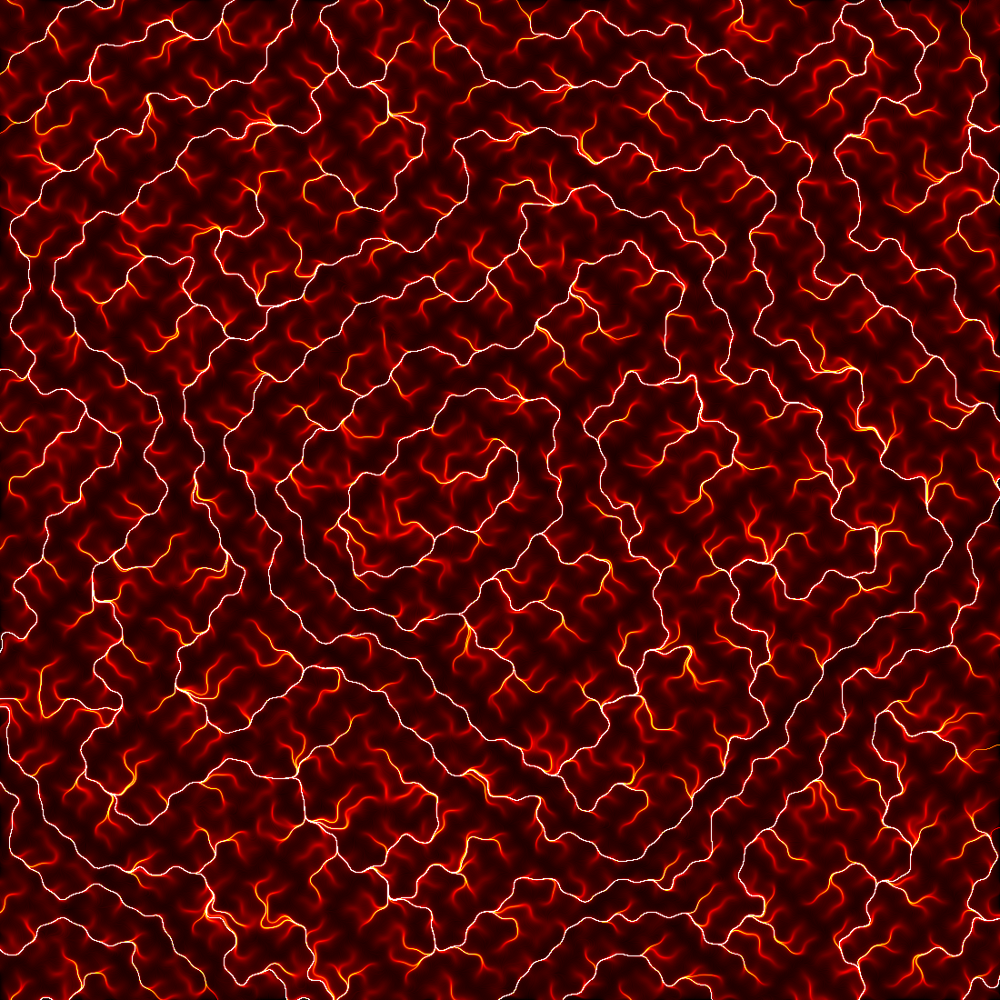

# Eremu
A simple Java application for approximating and drawing integral curves for a unit vector field.

## How the images are rendered

The unit vector field whose integral curves are rendered is defined by the heading of each vector (specified in the traditional radians anticlockwise about the x-axis).  The curves are approximated by iteratively moving a small amount in the direction of the heading for those coördinates.

Pixels in the image correspond directly to rectangular regions of the plane.  Each pixel is coloured depending on how many times an iteration of a curve moves into it.

For example, at the coördinates *x* and *y*, a heading of 6√(*x*² + *y*²) + 6sin(*x*)cos(*y*) + 3cos(2*x*)sin(2*y*) + 2cos(6*x*)cos(6*y*) + sin(16*x*)sin(16*y*) yields the following:

## Todo
Everything is hard-coded at the moment.  Eventually, it would be nice if the user could, without manually changing code, specify:
- The heading function for the vector field
- The colour scheme
- The resolution of the image
- The area of the plane rendered in the image
- The quality of the image (the number of curves drawn)

The quality of the approximation (the size of the delta used to approximate the curves) should probably be a hard-coded fraction of the plane area's width or height, not a fixed amount.
